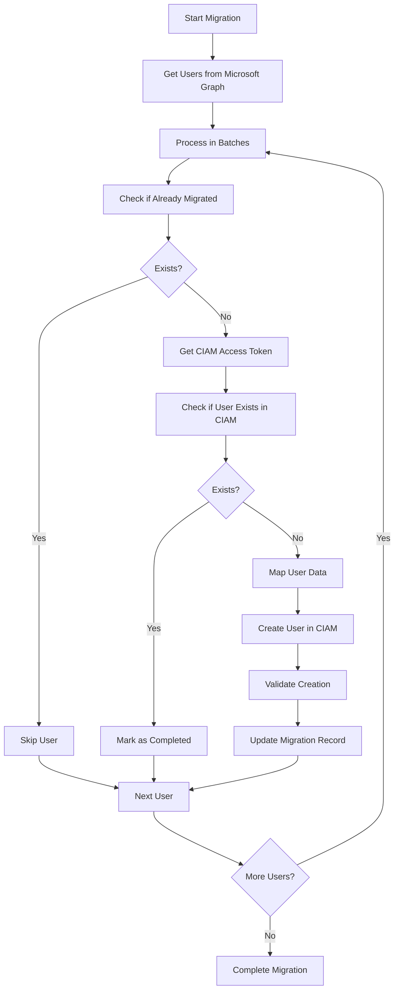

# Migration Tool Architecture

## Overview

The CIAM Migration Tool has been reorganized into a clean, maintainable architecture with proper separation of concerns and dependency injection.

## Project Structure

```
PartnersHub.CiamMigrationTool/
??? Models/
?   ??? MigrationModels.cs           # All data models and DTOs
??? Services/
?   ??? CiamService.cs              # CIAM API operations
?   ??? MicrosoftGraphService.cs    # Microsoft Graph operations
?   ??? MigrationService.cs         # Main migration orchestration
?   ??? UserMappingService.cs       # User data transformation
?   ??? MigrationRepository.cs      # Data persistence operations
?   ??? ServiceConfiguration.cs    # Configuration classes and logging
??? Program.cs                      # Main entry point with DI setup
??? appsettings.json               # Configuration file
??? README.md                      # Documentation
```

## Service Architecture

### 1. **CiamService** (`ICiamService`)
**Responsibility**: Handle all CIAM API operations
- `GetAccessTokenAsync()` - OAuth2 authentication
- `CreateUserAsync()` - User creation in CIAM
- `GetUserByUsernameAsync()` - Search by username
- `GetUserByEmailAsync()` - Search by email
- `ValidateUserAsync()` - Verify user exists

### 2. **MicrosoftGraphService** (`IMicrosoftGraphService`)
**Responsibility**: Handle Microsoft Graph API operations
- `GetUsersAsync()` - Paginated user retrieval
- `GetUserByIdAsync()` - Single user lookup
- `GetTotalUsersCountAsync()` - Total user count
- `SearchUsersByEmailAsync()` - Email-based search

### 3. **MigrationService** (`IMigrationService`)
**Responsibility**: Orchestrate the migration process
- `StartMigrationAsync()` - Full migration workflow
- `MigrateUserAsync()` - Single user migration
- `GetMigrationStatusAsync()` - Migration status reporting
- `RetryFailedMigrationsAsync()` - Retry failed migrations

### 4. **UserMappingService** (`IUserMappingService`)
**Responsibility**: Transform user data between systems
- `MapToCiamUser()` - Microsoft ? CIAM user mapping
- `GenerateUsername()` - Username generation logic
- `ExtractCompanyId()` - Company ID extraction

### 5. **MigrationRepository** (`IMigrationRepository`)
**Responsibility**: Data persistence and retrieval
- `GetByMicrosoftUserIdAsync()` - Find migration record
- `GetAllAsync()` - All migration records
- `GetFailedMigrationsAsync()` - Failed migrations for retry
- `AddAsync()` / `UpdateAsync()` - CRUD operations

## Key Features

### ? **Separation of Concerns**
- Each service has a single responsibility
- Clear interfaces define contracts
- Easy to test and maintain

### ? **Error Handling**
- Comprehensive exception handling
- Detailed logging at each layer
- Graceful degradation

### ? **Retry Logic**
- Configurable retry attempts
- Exponential backoff between batches
- Failed migration tracking

### ? **Configuration Management**
- Separate configuration classes
- Environment-based settings
- Easy to modify without code changes

### ? **Logging**
- Structured logging interface
- Multiple log levels (Info, Warning, Error)
- Easy to extend with different providers

## Migration Process Flow



## Configuration

### Microsoft Graph
```json
{
  "MicrosoftGraph": {
    "ClientId": "your-azure-app-client-id",
    "ClientSecret": "your-azure-app-client-secret",
    "TenantId": "your-azure-tenant-id"
  }
}
```

### CIAM Settings
```json
{
  "CIAM": {
    "BaseUrl": "https://uat-api.pif.gov.sa:9003/ciam/api/v1",
    "TokenUrl": "https://uat-api.pif.gov.sa:9003/ciam/api/v1/oauth2/token",
    "ClientId": "6wlZfzVCmDWeY4gAPgJ_wBG_z3ka",
    "ClientSecret": "yohZcqJVcu7rwYbIsWmIxZZbw4757_BmviVTK3KtlXIa",
    "Scopes": "internal_user_mgt_create internal_user_mgt_list internal_user_mgt_update internal_user_mgt_view"
  }
}
```

### Migration Settings
```json
{
  "Migration": {
    "BatchSize": 10,
    "DelayBetweenBatches": 5000,
    "MaxRetries": 3
  }
}
```

## Usage Examples

### 1. **Full Migration**
```csharp
var migratedCount = await migrationService.StartMigrationAsync();
Console.WriteLine($"Migrated {migratedCount} users");
```

### 2. **Single User Migration**
```csharp
var user = await graphService.GetUserByIdAsync("user-id");
var result = await migrationService.MigrateUserAsync(user);
```

### 3. **User Mapping Test**
```csharp
var ciamUser = userMappingService.MapToCiamUser(microsoftUser);
Console.WriteLine($"Mapped to username: {ciamUser.UserName}");
```

### 4. **Status Reporting**
```csharp
var records = await migrationService.GetMigrationStatusAsync();
var failed = records.Where(r => r.Status == MigrationStatus.Failed);
```

## Menu Options

1. **Start Full Migration** - Migrate all users from Microsoft Graph
2. **View Migration Status** - Show progress and statistics  
3. **Retry Failed Migrations** - Retry previously failed migrations
4. **Test Microsoft Graph Connection** - Verify Graph API connectivity
5. **Test CIAM Connection** - Verify CIAM API connectivity
6. **Migrate Single User** - Migrate specific user by email/UPN
7. **User Mapping Test** - Test user data transformation

## Error Handling

- **Network Errors**: Automatic retry with exponential backoff
- **Authentication Errors**: Clear error messages with troubleshooting steps
- **Validation Errors**: Skip invalid users and continue processing
- **Rate Limiting**: Configurable delays between API calls
- **Data Mapping Errors**: Fallback values and sanitization

## Extensibility

### Adding New Services
1. Create interface in `Services/` folder
2. Implement the interface
3. Register in `InitializeServices()` method
4. Inject into dependent services

### Adding New Configuration
1. Add configuration class to `ServiceConfiguration.cs`
2. Load in `InitializeServices()` method
3. Pass to relevant services

### Adding Database Support
1. Replace `InMemoryMigrationRepository` with EF implementation
2. Add connection string to configuration
3. Create migration scripts

## Production Deployment

### Requirements
- .NET 8 Runtime
- Network access to Microsoft Graph and CIAM APIs
- Proper API credentials and permissions
- SQL Server (if using database persistence)

### Setup Steps
1. Update `appsettings.json` with production credentials
2. Install as Windows Service or deploy to container
3. Configure logging provider (Serilog, NLog, etc.)
4. Set up monitoring and alerting
5. Create database schema (if using SQL persistence)

This architecture provides a solid foundation for the migration tool with proper separation of concerns, testability, and maintainability.